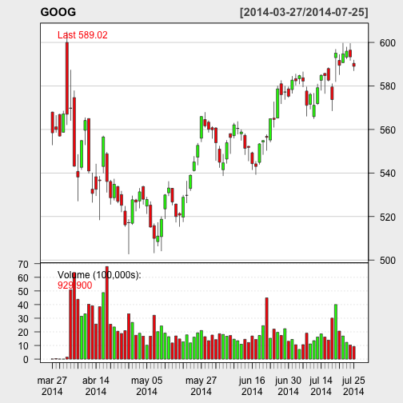

 
Magic Trade
========================================================
author: Javier Martínez 
date: Sun Jul 27 22:34:00 2014

Abstract
========================================================

Magic Trade is a shiny application to analyze and predict
different financial assets.
In order to make a technical analysis of the selected asset 
we get:

- Candle charts of the close price in time series
- Technical indicators like EMA, ATR, RSI, MACD, Stoch
- ARIMA prediction model  


Packages
========================================================

We use TTR, xts, forecast and quantmod packages in order to get the data 
and to make the technical analysis:
To get the data we use getSymbols() function:

```r
library(TTR)
library(quantmod)
library(xts)
library(forecast)
getSymbols("GOOG")
```

```
[1] "GOOG"
```
Once we get the data we can plot them with candleChart()
function and include technical indicators with addTA() and 
the indicator selected.

Visit: http://www.rdocumentation.org/packages/TTR

Assets
========================================================

We select just five assets to show the idea of a type of
expert advisor platform.
You can select quotes from S&P 500 index, IBEX35 index,
Google, Microsoft and APPLE stocks.
The next plot is Google daily quotes from Yahoo Finance.

 


Prediction
=======================================================

To predict the quote of the next day, just one day ahead,
we will use the ARIMA methodology, popularized by Box & Jenkins in 60s.
We use auto.arima() function to get the most appropriate 
arima model for the time series selected.

```r
close <- ts(Delt(Cl(GOOG)))
mod <- auto.arima(close)
pred <- predict(mod,n.ahead=1)
pred[1]
```

```
$pred
Time Series:
Start = 85 
End = 85 
Frequency = 1 
[1] 0
```
Depending on predicted return we advise: BUY, SELL or HOLD,
for positive, negative or zero return.


